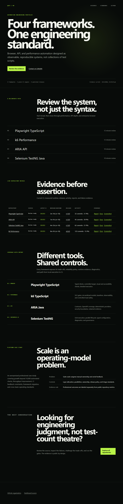
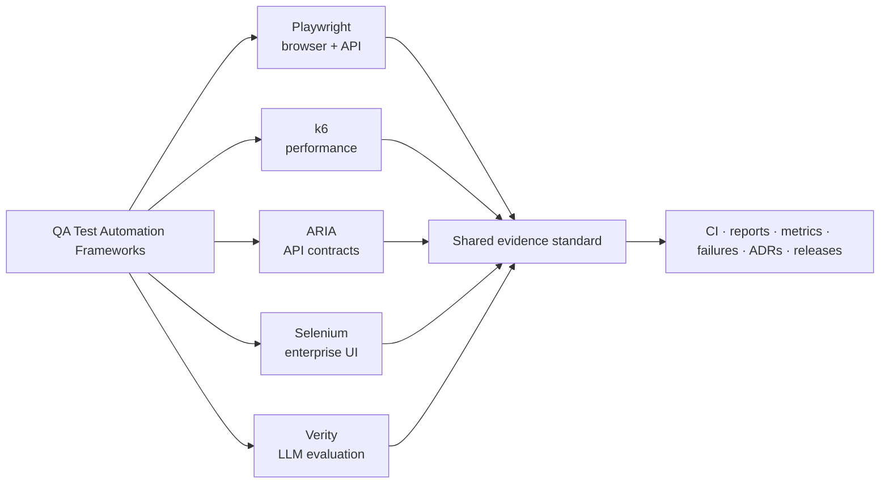

# Quality engineering, made observable.

Five review-ready reference frameworks for browser, API, accessibility,
visual, performance, and LLM-evaluation quality engineering. Built by
Prayag Vyas, Senior Quality Engineer (7+ years). Each repository is designed
to be reviewed, run, challenged, and adapted.

[**Explore the evidence dashboard**](https://qa-test-automation-frameworks.github.io/.github/)
&nbsp;&nbsp;·&nbsp;&nbsp;
[Review the repositories](#recommended-review-order)
&nbsp;&nbsp;·&nbsp;&nbsp;
[LinkedIn](https://www.linkedin.com/in/prayag-vyas/)

## What This Organization Demonstrates

This is not a collection of sample tests. It is a portfolio of automation systems
with explicit architecture, controlled execution targets, measurable CI behavior,
failure evidence, reliability policies, security controls, and release discipline.

| Engineering surface | Repository | What to inspect first |
| --- | --- | --- |
| LLM evaluation and judge calibration | [Verity Policy Coverage Eval](https://github.com/qa-test-automation-frameworks/verity-policy-coverage-eval-framework) | Three-tier eval pyramid, cassette replay, seeded defects, calibration, judge-bias controls |
| Modern browser, API, visual, accessibility | [Playwright TypeScript](https://github.com/qa-test-automation-frameworks/playwright-typescript-framework) | Typed fixtures, controlled target, sharded CI, visual baselines, Axe, Allure |
| Performance and reliability | [k6 Performance](https://github.com/qa-test-automation-frameworks/k6-performance-framework) | SLO gates, six workload models, regression baselines, Grafana, OpenTelemetry |
| API contracts and security boundaries | [ARIA API](https://github.com/qa-test-automation-frameworks/aria-api-framework) | Service layers, Pact, OpenAPI coverage, deterministic provider, redacted diagnostics |
| Enterprise browser execution | [Selenium TestNG Java](https://github.com/qa-test-automation-frameworks/selenium-testng-java-framework) | Grid matrix, parallel drivers, typed configuration, failure diagnostics, governance |

## Recommended Review Order

| Order | Repository | Reviewer question | Time |
| ---: | --- | --- | ---: |
| 1 | [Portfolio dashboard](https://qa-test-automation-frameworks.github.io/.github/) | Are the CI, runtime, releases, and evidence current? | 3 min |
| 2 | [Verity Policy Coverage Eval](https://github.com/qa-test-automation-frameworks/verity-policy-coverage-eval-framework) | How are non-determinism, judge calibration, and LLM-eval cost controlled? | 12 min |
| 3 | [Playwright TypeScript](https://github.com/qa-test-automation-frameworks/playwright-typescript-framework) | How is a broad test strategy kept deterministic and maintainable? | 12 min |
| 4 | [k6 Performance](https://github.com/qa-test-automation-frameworks/k6-performance-framework) | How are load safety, SLOs, baselines, and observability engineered? | 12 min |
| 5 | [ARIA API](https://github.com/qa-test-automation-frameworks/aria-api-framework) | How are contracts, schemas, security checks, and diagnostics layered? | 10 min |
| 6 | [Selenium TestNG Java](https://github.com/qa-test-automation-frameworks/selenium-testng-java-framework) | How does the design scale across browsers, threads, and Grid capacity? | 10 min |

## Live Proof

| Repository | CI | Report | Release | Review guide |
| --- | --- | --- | --- | --- |
| [Verity Policy Coverage Eval](https://github.com/qa-test-automation-frameworks/verity-policy-coverage-eval-framework) |  | [Eval report](https://qa-test-automation-frameworks.github.io/verity-policy-coverage-eval-framework/) | [v0.1.0](https://github.com/qa-test-automation-frameworks/verity-policy-coverage-eval-framework/releases/tag/v0.1.0) | [Review path](https://github.com/qa-test-automation-frameworks/verity-policy-coverage-eval-framework/blob/main/docs/reviewer-guide.md) |
| [Playwright TypeScript](https://github.com/qa-test-automation-frameworks/playwright-typescript-framework) |  | [Allure](https://qa-test-automation-frameworks.github.io/playwright-typescript-framework/) | [v1.0.0](https://github.com/qa-test-automation-frameworks/playwright-typescript-framework/releases/tag/v1.0.0) | [Review path](https://github.com/qa-test-automation-frameworks/playwright-typescript-framework/blob/main/docs/portfolio-review-guide.md) |
| [k6 Performance](https://github.com/qa-test-automation-frameworks/k6-performance-framework) |  | [Performance reports](https://qa-test-automation-frameworks.github.io/k6-performance-framework/) | [v0.4.0](https://github.com/qa-test-automation-frameworks/k6-performance-framework/releases/tag/v0.4.0) | [Evidence guide](https://github.com/qa-test-automation-frameworks/k6-performance-framework/blob/main/docs/evidence.md) |
| [ARIA API](https://github.com/qa-test-automation-frameworks/aria-api-framework) |  | [Allure](https://qa-test-automation-frameworks.github.io/aria-api-framework/) | [v1.0.0](https://github.com/qa-test-automation-frameworks/aria-api-framework/releases/tag/v1.0.0) | [Review path](https://github.com/qa-test-automation-frameworks/aria-api-framework/blob/main/docs/Portfolio_Review_Guide.md) |
| [Selenium TestNG Java](https://github.com/qa-test-automation-frameworks/selenium-testng-java-framework) |  | [Allure](https://qa-test-automation-frameworks.github.io/selenium-testng-java-framework/) | [v1.0.0](https://github.com/qa-test-automation-frameworks/selenium-testng-java-framework/releases/tag/v1.0.0) | [Review path](https://github.com/qa-test-automation-frameworks/selenium-testng-java-framework/blob/main/docs/PORTFOLIO_REVIEW_GUIDE.md) |

## Shared Engineering Standard

These repositories are one layered quality-engineering strategy rather than
isolated examples: Playwright proves modern UI/API coverage against a
repo-owned target, ARIA proves deterministic API and contract boundaries, k6
proves governed performance evidence, Selenium proves Java/Grid execution
discipline, and Verity applies the same determinism and evidence standards to
LLM evaluation.

- **Determinism:** controlled targets, seeded data, pinned runtimes, and reproducible commands.
- **Reliability:** explicit retry budgets, quarantine rules, runtime metrics, and flake triage.
- **Diagnostics:** screenshots, logs, traces, request evidence, and actionable failure examples.
- **Architecture:** documented trade-offs, ADRs, ownership boundaries, and extension points.
- **Governance:** CI quality gates, dependency scanning, SBOMs, release notes, and reviewer paths.
- **Honesty:** limitations, target realism, and professional claims are labeled precisely.

## Portfolio Architecture

## Platform Case Study

The [automation platform scaling case study](../docs/automation-platform-scaling-case-study.md)
connects the repository evidence to anonymized professional experience with
real before/after outcomes: suite stability improved from about 40% to about
90%, full-suite runtime dropped from about 2 hours to about 15 minutes, UI-heavy
coverage was rebalanced from 1,000+ checks to 40 critical E2E journeys plus API
coverage, critical scope reached 100% automation about one month early, and
authoring throughput improved by about 3x.

> The fastest way to evaluate this work is to open the
> [evidence dashboard](https://qa-test-automation-frameworks.github.io/.github/),
> choose a framework, inspect its latest CI and failure evidence, then run its
> documented local quality gate.
