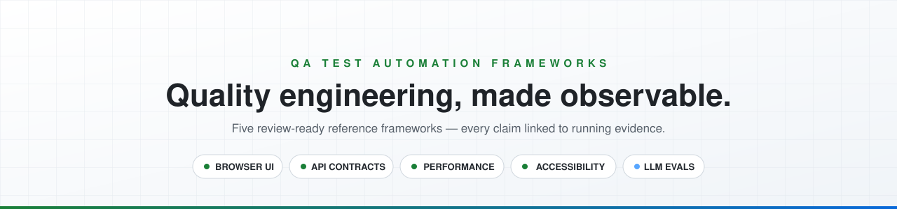
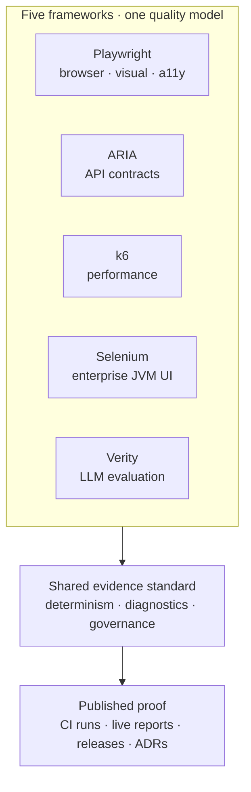

<picture>
  <source media="(prefers-color-scheme: dark)" srcset="assets/banner-dark.svg">
  <source media="(prefers-color-scheme: light)" srcset="assets/banner-light.svg">
  
</picture>

Reference frameworks for browser, API, performance, accessibility, visual, and
LLM-evaluation quality engineering — built by [**Prayag Vyas**](https://www.linkedin.com/in/prayag-vyas/),
Senior Quality Engineer (7+ years). This is not a collection of sample tests:
each repository is a governed system with explicit architecture, controlled
targets, failure evidence, and CI you can audit.

[**Evidence dashboard**](https://qa-test-automation-frameworks.github.io/.github/)
&nbsp;·&nbsp;
[The frameworks](#the-frameworks)
&nbsp;·&nbsp;
[Review paths](#choose-your-review-depth)
&nbsp;·&nbsp;
[LinkedIn](https://www.linkedin.com/in/prayag-vyas/)

## The Frameworks

| Framework | What it demonstrates | Evidence |
| --- | --- | --- |
| [**Verity Policy Coverage Eval**](https://github.com/qa-test-automation-frameworks/verity-policy-coverage-eval-framework) Python · pytest · RAG + tool use | LLM evaluation engineered like software: a three-tier eval pyramid (deterministic gate → semantic evals → adversarial), cassette replay, seeded defects, and judge calibration with bias controls. The hermetic tier runs without provider keys. |  [Eval report](https://qa-test-automation-frameworks.github.io/verity-policy-coverage-eval-framework/) · [v0.1.0](https://github.com/qa-test-automation-frameworks/verity-policy-coverage-eval-framework/releases/tag/v0.1.0) · [Review guide](https://github.com/qa-test-automation-frameworks/verity-policy-coverage-eval-framework/blob/main/docs/reviewer-guide.md) |
| [**Playwright TypeScript**](https://github.com/qa-test-automation-frameworks/playwright-typescript-framework) TypeScript · Playwright · Zod · Allure | Modern browser coverage against a repo-owned target: strict typing, reusable fixtures, typed API clients, visual baselines, Axe accessibility checks, sharded Linux/Windows CI, and a governed retry budget with expiring quarantine. |  [Allure report](https://qa-test-automation-frameworks.github.io/playwright-typescript-framework/) · [v1.0.0](https://github.com/qa-test-automation-frameworks/playwright-typescript-framework/releases/tag/v1.0.0) · [Review guide](https://github.com/qa-test-automation-frameworks/playwright-typescript-framework/blob/main/docs/portfolio-review-guide.md) |
| [**k6 Performance**](https://github.com/qa-test-automation-frameworks/k6-performance-framework) k6 · TypeScript · Grafana · OpenTelemetry | Performance testing as a governed system: six workload models, SLO-based gates, reviewed regression baselines, Grafana/InfluxDB observability, and load-safety rules that keep public targets read-only. |  [Performance reports](https://qa-test-automation-frameworks.github.io/k6-performance-framework/) · [v0.4.0](https://github.com/qa-test-automation-frameworks/k6-performance-framework/releases/tag/v0.4.0) · [Evidence guide](https://github.com/qa-test-automation-frameworks/k6-performance-framework/blob/main/docs/evidence.md) |
| [**ARIA API**](https://github.com/qa-test-automation-frameworks/aria-api-framework) Java 21 · Pact · WireMock · OpenAPI | API testing above the endpoint-script level: layered clients and services, a deterministic provider, Pact consumer contracts with provider verification, JSON-schema assertions, OpenAPI endpoint coverage, and redacted diagnostics. |  [Allure report](https://qa-test-automation-frameworks.github.io/aria-api-framework/) · [v1.0.0](https://github.com/qa-test-automation-frameworks/aria-api-framework/releases/tag/v1.0.0) · [Review guide](https://github.com/qa-test-automation-frameworks/aria-api-framework/blob/main/docs/Portfolio_Review_Guide.md) |
| [**Selenium TestNG Java**](https://github.com/qa-test-automation-frameworks/selenium-testng-java-framework) Java 21 · Selenium 4 · TestNG · Docker Grid | The JVM execution discipline enterprises still run on: thread-local drivers, explicit-wait-only synchronization, Docker Grid with capacity guidance, multi-browser CI, and redaction-aware Allure diagnostics. |  [Allure report](https://qa-test-automation-frameworks.github.io/selenium-testng-java-framework/) · [v1.0.0](https://github.com/qa-test-automation-frameworks/selenium-testng-java-framework/releases/tag/v1.0.0) · [Review guide](https://github.com/qa-test-automation-frameworks/selenium-testng-java-framework/blob/main/docs/PORTFOLIO_REVIEW_GUIDE.md) |

## Choose Your Review Depth

| Time | Path | The question it answers |
| --- | --- | --- |
| **3 minutes** | Open the [evidence dashboard](https://qa-test-automation-frameworks.github.io/.github/) — refreshed on a schedule from live CI metadata, validated before publish, readable without JavaScript. | Is the CI green, are the releases real, and is the evidence current? |
| **15 minutes** | Follow the [Verity reviewer guide](https://github.com/qa-test-automation-frameworks/verity-policy-coverage-eval-framework/blob/main/docs/reviewer-guide.md) and the [Playwright review guide](https://github.com/qa-test-automation-frameworks/playwright-typescript-framework/blob/main/docs/portfolio-review-guide.md). | How are LLM non-determinism and browser flakiness actually controlled? |
| **Deep review** | Work through all five in order — Verity → Playwright → k6 → ARIA → Selenium — each with a documented, time-boxed review path. | Does the same engineering standard hold across every quality surface? |

## Why Five Frameworks

Each repository owns one surface of a layered quality model, and they are meant
to be read together: Playwright proves modern browser, visual, and accessibility
coverage; ARIA proves API behavior at the contract level; k6 proves performance
evidence under governed load; Selenium proves the JVM execution patterns large
teams still depend on; and Verity applies the same determinism and evidence
standards to the newest surface — LLM evaluation. One quality strategy,
demonstrated five ways.

## The Engineering Standard

- **Determinism** — controlled targets, seeded data, pinned runtimes, reproducible commands.
- **Reliability** — explicit retry budgets, quarantine rules with expiry, runtime metrics, flake triage.
- **Diagnostics** — screenshots, traces, structured logs, request evidence, documented failure examples.
- **Architecture** — ADRs, documented trade-offs, ownership boundaries, extension points.
- **Governance** — CI quality gates, dependency scanning, SBOMs, release notes, reviewer paths.
- **Honesty** — limitations are labeled, and a CI job fails any document that uses unverifiable self-assessment language.

## How It Fits Together

## Field Results

The patterns in these repositories come from practice. An anonymized
[platform scaling case study](../docs/automation-platform-scaling-case-study.md)
documents one client migration built on the same strategy — replace raw test
count with a layered pyramid of critical journeys plus API coverage:

| Measure | Before | After |
| --- | --- | --- |
| Suite stability | ~40% reliable | ~90% reliable |
| Full-suite runtime | ~2 hours | ~15 minutes |
| Test mix | 1,000+ UI-heavy checks | 40 critical E2E journeys + API coverage |
| Authoring throughput | baseline | ~3× faster |

The fixture, data-builder, and reporting conventions behind those numbers are
implemented publicly in the Playwright and ARIA repositories; the CI-tuning and
runtime-metrics approach is visible in every workflow here.

---

> **Reviewing this portfolio?** Open the
> [evidence dashboard](https://qa-test-automation-frameworks.github.io/.github/),
> pick a framework, inspect its latest CI run and failure evidence, then run its
> documented local quality gate. Everything above is designed to be challenged.
